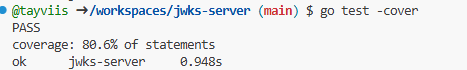

# Tayvis Sanders JWKS Server Project

## Overview
This project implements a JWKS server in Go.

What does it do?:
- Generates RSA key pairs
- Assigns unique `kid` values
- Implements key expiry
- Serves a JWKS endpoint
- Issues JWTs via `/auth`
- Supports expired JWTs using `?expired=true`

## Examples

Generate valid JWT:
curl -X POST http://localhost:8080/auth

Generate expired JWT:
curl -X POST http://localhost:8080/auth?expired=true

View JWKS:
curl http://localhost:8080/.well-known/jwks.json

### GET /.well-known/jwks.json
Returns the active public key in JWKS format.

### POST /auth
Returns a signed JWT.

Optional query parameter:
- `?expired=true` → issues JWT signed with expired key.

## Running the Server

go run main.go

## Running Tests

go test -cover

Current test coverage: 80.6%

## Test Coverage

Run:

go test -cover

Current coverage: 80.6%
## Test Client Running Against Server

## Test Suite Coverage
